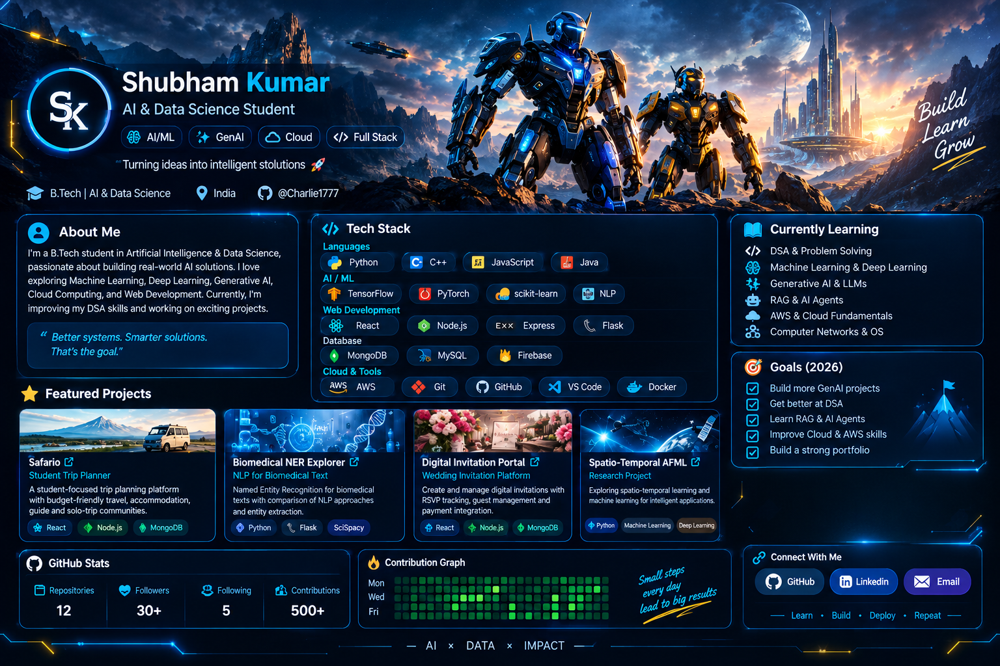

<!-- ===================== HERO ===================== -->
<p align="center">
  
</p>

<!-- ===================== TYPING ===================== -->
<p align="center">
  <a href="https://github.com/Charlie1777">
    
  </a>
</p>

<p align="center">
  <a href="https://github.com/Charlie1777">
    
  </a>
  <a href="https://github.com/Charlie1777?tab=repositories">
    
  </a>
  <a href="https://github.com/Charlie1777">
    
  </a>
</p>

---

## 👨‍💻 About Me

Hi! I'm **Shubham Kumar**, a **B.Tech student in Artificial Intelligence & Data Science**.

I enjoy building practical software and AI systems that solve real-world problems. My current focus is on **Machine Learning, Deep Learning, Generative AI, RAG, AI Agents, Cloud Computing, and Full Stack Development**.

```text
AI/ML        → Machine Learning • Deep Learning • NLP
GenAI        → LLMs • RAG • AI Agents
Development  → React • Node.js • Express • Flask
Data         → MongoDB • MySQL • Data Processing
Cloud        → AWS • Vercel • Docker
Core         → DSA • OOP • Computer Networks • OS
```

> **“Better systems. Smarter solutions. That's the goal.”**

---

## 🧠 Tech Stack

### Languages
<p>
  
</p>

### AI / Machine Learning
<p>
  
  
  
</p>

### Web Development
<p>
  
</p>

### Databases / Backend Tools
<p>
  
</p>

### Cloud / Tools
<p>
  
</p>

---

## 🚀 Featured Projects

<table>
<tr>
<td width="50%">

### 🧭 Safario
**Student Trip Planner**

A student-focused trip planning platform for budget-friendly travel, accommodation, guides, and solo/group trips.

**Stack:** React • Node.js • MongoDB

</td>
<td width="50%">

### 🧬 Biomedical NER Explorer
**NLP for Biomedical Text**

Named Entity Recognition for biomedical text with comparison of NLP approaches and entity extraction.

**Stack:** Python • Flask • SciSpace

</td>
</tr>

<tr>
<td width="50%">

### 💌 Digital Invitation Portal
**Wedding Invitation Platform**

A web platform for creating and managing digital invitations with RSVP tracking, guest management, and payment integration.

**Stack:** React • Node.js • MongoDB

</td>
<td width="50%">

### 🧠 Spatio-Temporal AFML
**Research Project**

Exploring spatio-temporal learning and machine learning methods for intelligent EV charging-station applications.

**Stack:** Python • Machine Learning • Deep Learning

</td>
</tr>
</table>

---

## 📚 Currently Learning

- 🧩 DSA & Problem Solving
- 🧠 Machine Learning & Deep Learning
- ✨ Generative AI & LLMs
- 🤖 RAG & AI Agents
- ☁️ AWS & Cloud Fundamentals
- 🌐 Computer Networks & Operating Systems

---

## 🎯 2026 Goals

```text
[✓] Build more GenAI projects
[✓] Improve DSA skills
[→] Learn RAG & AI Agents
[→] Improve Cloud & AWS skills
[→] Build a strong project portfolio
```

---

## 📊 GitHub Analytics

<p align="center">
  
  
</p>

<p align="center">
  
</p>

---

## 🐍 Contribution Activity

<p align="center">
  
</p>

---

## 🌐 Connect With Me

<p align="center">
  <a href="https://github.com/Charlie1777">
    
  </a>
  <a href="https://www.linkedin.com/">
    
  </a>
  <a href="mailto:your-email@example.com">
    
  </a>
</p>

---

<p align="center">
  <b>⚡ Learn • Build • Deploy • Repeat ⚡</b>
</p>

<p align="center">
  <i>AI × DATA × IMPACT</i>
</p>
